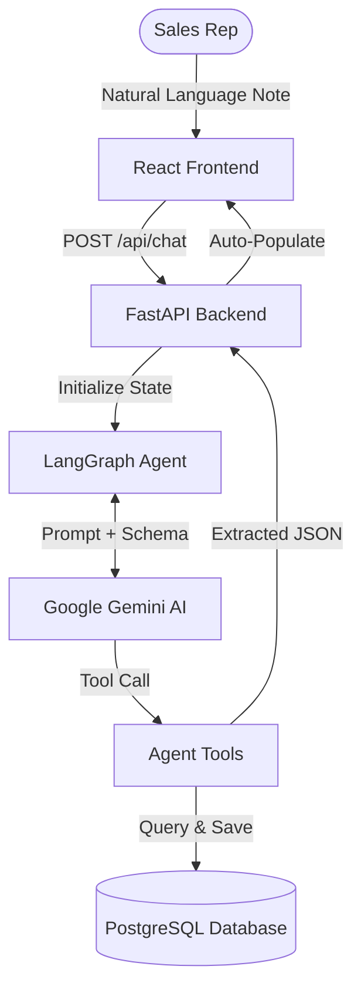

<div align="center">
 

  # AI-First Pharma CRM Assistant

  **Next-Generation Customer Relationship Management for Pharmaceutical Sales**

  [](https://reactjs.org/)
  [](https://fastapi.tiangolo.com/)
  [](https://www.postgresql.org/)
  [](https://langchain.com/)
  [](https://deepmind.google/technologies/gemini/)

  <p align="center">
    <em>Automate interaction logging, eliminate manual data entry, and get AI-powered insights from natural language.</em>
  </p>
</div>

---

## Overview

The **AI-First Pharma CRM Assistant** fundamentally changes how pharmaceutical sales representatives log and manage their Healthcare Professional (HCP) interactions. Instead of manually filling out tedious forms, representatives can simply type or dictate their meeting notes in plain English. 

The AI agent parses the natural language, automatically matches the HCP in the database, extracts key data points (Date, Time, Attendees, Discussion, Summary), and populates the CRM in real-time.

---

## See it in Action

> **Note:** Insert your demo video / GIF here!
>
> ``

---

## Key Features

- **Natural Language Processing (NLP)**: Powered by Gemini & LangGraph to interpret complex conversational logs.
- **Real-Time Form Auto-Fill**: Watch the CRM magically populate as the AI extracts the context.
- **Intelligent HCP Matching**: Fuzzy matching automatically identifies the correct doctor from the PostgreSQL database.
- **Agentic Tool-Calling**: Uses LangChain tool-calling to execute precise state updates without hallucinations.
- **Interaction History & Follow-ups**: Ask the AI to summarize past interactions and recommend strategic follow-up emails.

---

## Technology Stack

| Domain | Technology | Description |
| :--- | :--- | :--- |
| **Frontend** | React, Vite, Tailwind CSS, Redux | Lightning-fast SPA with a modern, glassmorphism UI |
| **Backend** | FastAPI, SQLAlchemy | High-performance Python backend for serving APIs |
| **Database** | PostgreSQL, SQLite (Dev) | Relational data modeling for HCPs and Interactions |
| **AI / LLM** | LangGraph, LangChain, Google Gemini | Stateful AI orchestration and function calling |

---

## Architecture Diagram



---

## Getting Started

### Prerequisites
- Node.js (v18+)
- Python (3.10+)
- Google Gemini API Key

### 1. Clone the Repository
```bash
git clone https://github.com/your-username/ai-pharma-crm.git
cd ai-pharma-crm
```

### 2. Backend Setup
```bash
cd backend

# Create and activate virtual environment
python -m venv .venv
source .venv/bin/activate  # On Windows: .venv\Scripts\activate

# Install dependencies
pip install -r requirements.txt

# Environment variables
cp .env.example .env
# Edit .env and add your GEMINI_API_KEY=...

# Run the backend
uvicorn app.main:app --reload
```

### 3. Frontend Setup
```bash
cd frontend

# Install dependencies
npm install

# Run the development server
npm run dev
```

---

## Usage Example

1. Open the app in your browser at `http://localhost:5173`.
2. Navigate to the **AI Assistant** chat panel.
3. Type a natural language log:
   > *"Met Dr. Rahul Mehta today at 10:30 AM over Zoom with Jane Smith. Discussed the efficacy of Prodo-X and he requested a follow-up next month."*
4. Watch the form on the left instantly populate with:
   - **HCP**: Dr. Rahul Mehta
   - **Meeting Type**: Virtual
   - **Time**: 10:30 AM
   - **Attendees**: Dr. Rahul Mehta, Jane Smith
   - **Discussion**: Efficacy of Prodo-X

---

## Roadmap

- [x] Natural Language Form Population
- [x] LangGraph Agentic Backend
- [x] Gemini API Migration
- [ ] Voice-to-Text Integration (`hospital-voice-agent`)
- [ ] Automated Calendar Integrations
- [ ] Sales Analytics Dashboard

---

## Author

**Vishmitha Poojary**  
*MCA Student | Full Stack & AI Developer*
